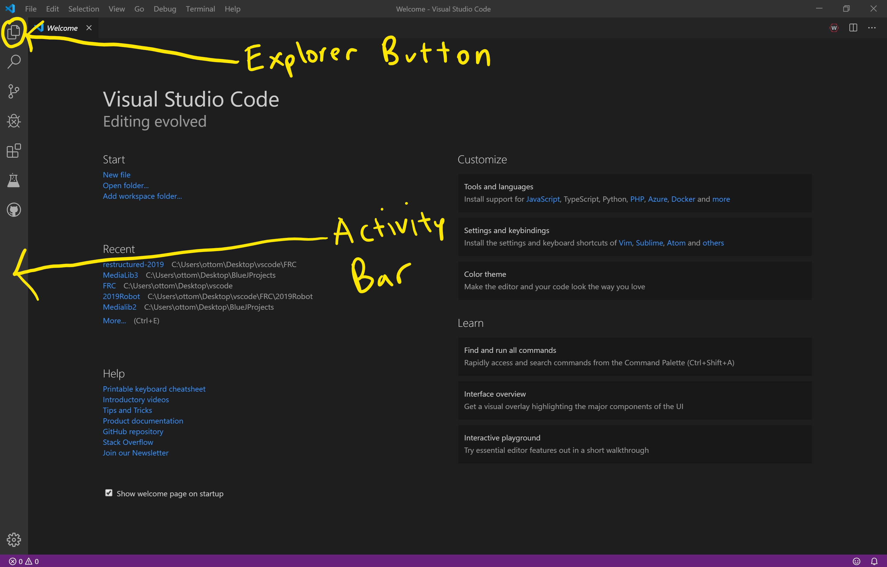
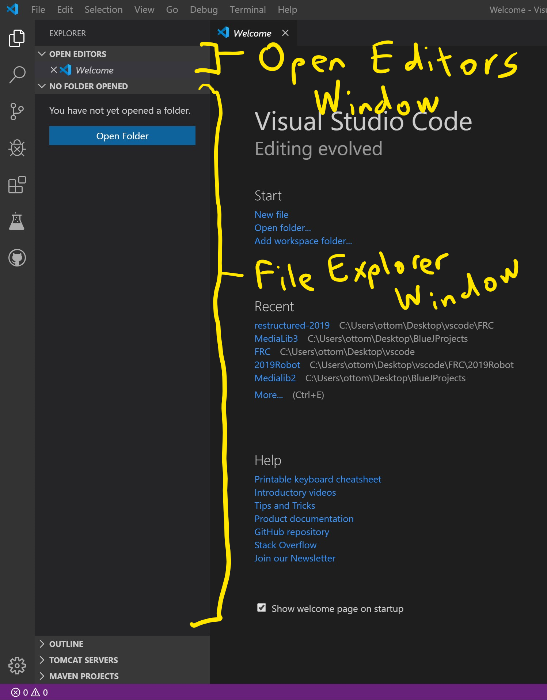
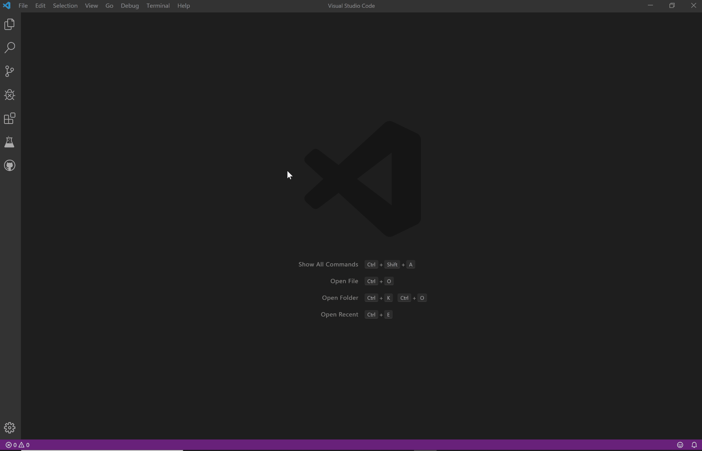

# Hello World: Introduction (1.1)

Welcome to FRC Programming Trainer, or FPT! We are excited to have you on our team. Before we begin programming, we need to ensure that you have a basic understanding of FPT, VSCode, and copying and pasting (the most important functions in programming).

## VSCode

VSCode is a wonderful editor built by Microsoft. Here are the two most important things about it:

### File Editing

On the left, there is a sidebar with some icons on it. This is called the **Activity Bar**. The topmost icon opens the **Explorer**.

The Explorer contains two main windows of interests:

- The **Open Editors** window - This window shows a list of all the files currently have open. You probably have nothing open right now.
- The **File Explorer** window - This window shows a tree of all the files in the project. This window has the same title of the opened folder, most likely "Project" when working in FPT. You can double click any of the files to open them in a text editor.

### Commands

Commands are how most functions in VSCode are completed. In order to run a command, you must first open the **Command Palette** by clicking **View → Command Palette** at the top or by hitting **Control+Shift+P**. In order to run a command, type the name of the command, highlight the command, and press **Enter**.

> Many of the basic functions in VSCode can be run with commands. For example, you can view the Explorer window using the "View: Show Explorer" command.

## FRC Programming Trainer

FPT is made up of **exercises**. Each exercise acts as a "level" where you must complete some sort of programming objective to advance to the next exercise. Along the way, you will learn many aspects of programming, from basic to advanced. Each exercise provides:

- Information on a certain programming aspect
- Instructions on how to complete the exercise

>Want to complete a different exercise? Run the **FPT: Open Exercise** command, select the exercise you wish to view, and select your user profile.

When you are ready to have your work verified, you can run the **FPT: Submit Exercise** command. If there are any errors in your work, you will be notified and asked to revise before you can continue to the next exercise.

>If you ever accidently close the the instructions window, you can reopen using the **FPT: Open Instructions** command.

Let's begin.

## Exercise

We will start with a simple copy and pasting exercise.

1. From the **Explorer,** open up the file called `Exercise.java`.

    >If you get warning along the lines of, "Classpath is incomplete", do not worry; you can ignore that for now.

2. Copy the following code: `System.out.print("Hello World!");`
3. Paste the code onto line 3.
4. Click the "Submit" button or run the **FPT: Submit Exercise** command.
